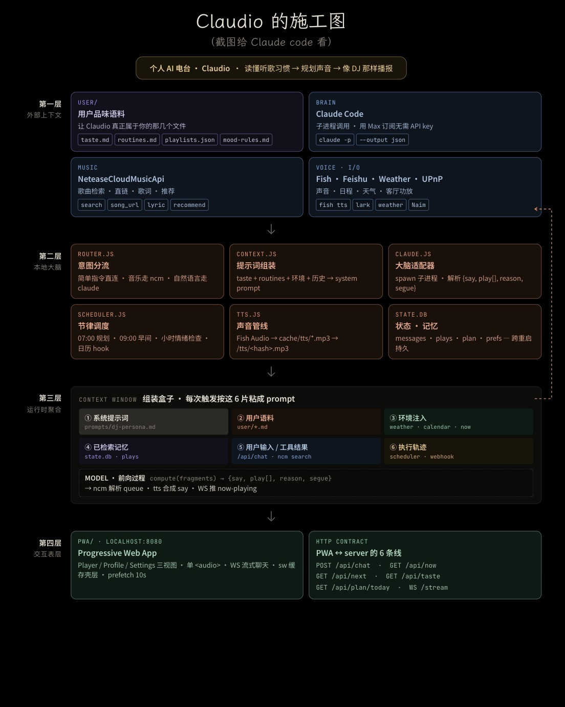

# Claudio

<p align="center">
  
</p>

个人 AI 电台：读懂你的听歌习惯 → 规划声音 → 像 DJ 那样播报。

施工图（截图给 Claude Code 看的那张）描述了完整意图，本仓库是它的实现。

## 五分钟跑起来

```bash
cd claudio
node server.js          # npm start 也行
# 打开 http://localhost:8080
```

依赖：
- Node 22+
- `claude` CLI（Max 订阅已登录）—— `which claude` 能找到即可
- macOS（dev TTS 用系统自带的 `say` + `afconvert`；不想用就给 `FISH_API_KEY`）

## 填用户语料

`user/` 下四份文件，Claudio 每次拼 prompt 都会读：

| 文件 | 用途 |
|---|---|
| `taste.md` | 喜欢 / 不喜欢 / 最近循环 |
| `routines.md` | 一天里几个固定时段，每段想听什么 |
| `playlists.json` | 常听歌单（可选） |
| `mood-rules.md` | 硬规则（深夜不要 130+ BPM）、软规则（雨天偏 ambient） |

仓库里只提交了 `*.example.*` 模板。首次 `node server.js` 启动会自动从模板复制出真实文件给你填。真实文件已在 `.gitignore`，不会被提交回去——它们是你私人的。

越具体 Claudio 越懂你。这是它"私人"的全部来源。

## 环境变量

| 变量 | 默认 | 说明 |
|---|---|---|
| `PORT` | 8080 | HTTP 端口 |
| `CLAUDE_BIN` | `claude` | claude 可执行路径 |
| `SCHEDULER_DISABLED` | — | `=1` 关自动节律（手动 fire 仍可用） |
| `FISH_API_KEY` | — | 给了就走 Fish Audio TTS，否则回退 macOS `say` |
| `FISH_VOICE_ID` | — | Fish 声音 reference id |
| `FISH_ENDPOINT` | `https://api.fish.audio/v1/tts` | |
| `SAY_VOICE` | `Tingting` | macOS `say` 用的中文女声 |
| `NCM_COOKIE` | — | 网易云 cookie 兜底；正常路径是 Settings 视图扫码登录，cookie 落 SQLite |

## HTTP / WS 合约

施工图第四层那 6 条线 + 调试/拓展端点：

| 方法 | 路径 | 用途 |
|---|---|---|
| POST | `/api/chat` | 用户 ↔ DJ 对话主入口 |
| GET | `/api/now` | 现在在播什么 |
| GET | `/api/next` | 队列 |
| GET | `/api/taste` | 用户语料（4 份合并） |
| GET | `/api/plan/today` | 今日规划 |
| WS | `/stream` | DJ 推 `chat / queue / tick / now` |
| GET | `/api/health` | 健康检查 + 当前 TTS 引擎 |
| POST | `/api/say` | TTS 合成 `{text}` → `{url, ...}` |
| POST | `/api/hook/calendar` | 外部日历事件触发即兴 |
| GET | `/api/scheduler` | 节律状态 + 下次触发时间 |
| POST | `/api/scheduler/fire/:name` | 手动 fire |
| GET | `/api/ncm/search?q=` | NCM 搜索 |
| GET | `/api/ncm/song/:id` | song_url 元数据 |
| GET | `/api/ncm/lyric/:id` | LRC 歌词 |
| GET | `/api/ncm/stream/:id` | 音频流代理（带 Referer，支持 Range） |
| POST | `/api/queue/resolve` | 手动喂 queue `{queries:[]}` |
| GET | `/tts/<hash>.<ext>` | 静态：TTS 缓存音频 |

## 节律调度

| Tick | 时机 | 干什么 |
|---|---|---|
| `plan-today` | 07:00 daily | 规划今天电台节奏，落 `plan` 表 |
| `morning-brief` | 09:00 daily | 早间开场 + 几首歌 |
| `mood-check` | 每整点 | 看最近播放 + 时段，要不要调氛围 |
| `calendar-hook` | 仅手动 | 外部事件触发即兴 |

手动触发：
```bash
curl -X POST localhost:8080/api/scheduler/fire/morning-brief

curl -X POST -H 'Content-Type: application/json' \
  -d '{"title":"周会","starts_at":"2026-05-21T14:00:00+08:00","minutes_until":15}' \
  localhost:8080/api/hook/calendar
```

## 一次完整的 DJ 闭环

1. 你跟 Claudio 说话 → `POST /api/chat { message }`
2. `router.js` 判断：是简单指令？是音乐意图（"搜歌 XX"）？还是自然语言？
3. 自然语言走 `claude.js` → spawn `claude -p --output-format json` → 系统 prompt 由 6 片拼成（DJ 人设 / 用户语料 / 环境 / 最近播放记忆 / 当前输入 / 执行轨迹）
4. 模型回 `{say, play[], reason, segue}` JSON
5. `say` → `POST /api/say` → Fish 或 `say` 合成 → m4a/mp3 落 `cache/tts/` → PWA `<audio>` 自动播
6. `play[]` → `ncm.resolveMany` 把每条 "歌名 - 艺人" 解析成 NCM 候选 → 写 `state.prefs.queue` → WS 推 `{type:'queue', items}` → PWA 渲染
7. PWA 点队列任意一首 → `/api/ncm/stream/:id` 流代理拉上游 → 浏览器播
8. 与此同时 `scheduler.js` 会在 07:00 / 09:00 / 整点 自己触发同样的链路

## 音频出口（声音怎么落地客厅）

PWA 用浏览器 `<audio>`，所以让浏览器音频落地的任何路径都能用：

1. **就近跑**：Claudio 跑在客厅附近的机器（Mac mini / Pi / 旧 MBP），音频口 / 光纤 / USB DAC 直接进 Naim
2. **AirPlay 2**：现代 Naim 支持，Mac 系统级 AirPlay 即可，零代码
3. **蓝牙 / 有线** 兜底

施工图里 UPnP 那一格是为「Claudio 跑别的机器 + 要程序化推流」这个特定拓扑准备的，目前没接，上面三条任一即可。

## 项目结构

```
claudio/
├── server.js              入口：HTTP + WS
├── src/
│   ├── state.js          SQLite (messages / plays / plan / prefs)
│   ├── claude.js         spawn claude -p，解析 {say, play[], reason, segue}
│   ├── context.js        6 片拼 system prompt
│   ├── router.js         cmd / music / claude 三向分流
│   ├── scheduler.js      节律调度 + manual fire
│   ├── tts.js            Fish + macOS say 双引擎 + hash 缓存
│   └── ncm.js            NeteaseCloudMusicApi 进程内包装
├── public/                PWA（HTML / CSS / JS / SW / manifest）
├── prompts/dj-persona.md  DJ 人设
├── user/                  用户语料（你自己填）
├── cache/tts/             TTS 缓存
└── state.db               SQLite（运行时生成，已 gitignore）
```

## 第三方服务声明

Claudio 调用以下外部服务，使用时请自行确认你遵守它们各自的服务条款：

- **Anthropic Claude**（通过 `claude` CLI）—— 你需自己拥有 Max 订阅或 Anthropic API 凭据
- **NeteaseCloudMusicApi**（非官方第三方包）—— 间接调用网易云音乐 API，仅供个人非商业使用
- **Fish Audio**（可选 TTS）—— 自带 API key
- **Google Fonts**（PWA 字体）—— 在线加载

本项目是个人玩具，没有任何商业用途，作者对使用结果不负责。

## 已知边界

- **在另一个 Claude Code 会话内 spawn `claude` 会 401**（nested auth），独立终端跑就正常 —— 这是当前最常见的「明明都对了为什么 chat 返回错」的原因
- **NCM 多数歌未登录拿不到 URL**：靠 `NCM_COOKIE`（从浏览器登录态复制 `MUSIC_U=...`）解锁
- **浏览器 autoplay**：必须有用户手势才能自动播，所以「点队列触发」合法，「被动收 WS 推送自己起播」会被拦 —— 当前实现用的是前者
- **NCM URL 时限**：拿到的 CDN URL 通常 ~30 分钟过期，目前没做磁盘缓存，每次重新解析

## 登录网易云

打开 PWA → Settings → 「登录网易云」按钮 → 弹出二维码 → 用网易云 APP 扫码 → Cookie 落 SQLite，重启不丢。

如果是 headless 部署（没 PWA 入口），用 `NCM_COOKIE` 环境变量兜底。

## 切引擎

```bash
# 切到 Fish Audio
export FISH_API_KEY=xxx
export FISH_VOICE_ID=<voice-uuid>     # 可选
node server.js

# 关掉自动节律（开发时不想被打扰）
SCHEDULER_DISABLED=1 node server.js
```
